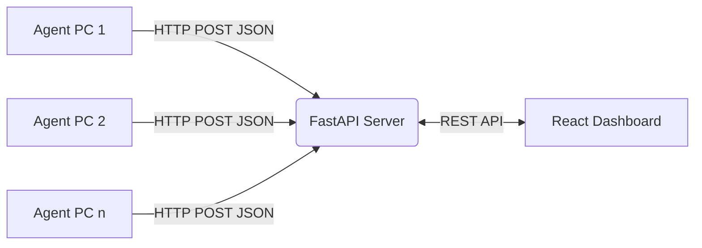

# Architecture Document

## 1. Arsitektur Sistem Terdistribusi
Sistem "Lab Monitor" ini mengadopsi pola arsitektur **Client-Server** yang terdiri dari 3 komponen utama:
1. **Agent (Client):** Pengumpul metrik sistem yang berjalan di mesin PC lab.
2. **Server (Backend):** *Middleware* dan agregator data yang mengekspos REST API.
3. **Dashboard (Frontend):** *Single Page Application (SPA)* untuk visualisasi data oleh administrator.



## 2. Tech Stack (Teknologi yang Digunakan)

### Backend (Server)
* **Framework:** FastAPI (Python)
* **Server Gateway:** Uvicorn
* **Arsitektur:** RESTful API dengan modul (*routers*, *store*).
* **Penyimpanan (*Store*):** *In-memory storage* (untuk tahap awal) / siap dihubungkan ke Database SQL/NoSQL di masa depan.

### Client (Agent)
* **Bahasa:** Python 3.10+
* **Pengumpul Metrik:** Modul *psutil* atau skrip telemetri khusus
* **GUI Konfigurasi:** Tkinter/PyQt 
* **Kompilator:** PyInstaller

### Frontend (Dashboard)
* **Framework:** React 19 + Vite
* **Styling:** Tailwind CSS + Autoprefixer + PostCSS
* **Ikonografi & UI:** Lucide React, SweetAlert2
* **Visualisasi Data:** Recharts
* **HTTP Client:** Axios

## 3. Struktur Direktori Proyek

```text
monitoring-lab/
├── agent/                  # Klien pemantau
│   ├── agent.py            # Main loop & logic pengirim
│   ├── collector.py        # Pengumpul metrik OS (CPU, RAM, dll)
│   ├── config.py / .json   # Manajemen konfigurasi lokal
│   ├── gui.py              # Window UI setup awal
│   └── agent.spec          # Konfigurasi Pyinstaller build
├── server/                 # REST API
│   ├── server.py           # Entry point
│   ├── main.py             # Inisialisasi FastAPI
│   ├── store.py            # Logika penyimpanan state (Data)
│   ├── routes/             # Endpoints (agents.py, files.py)
│   └── shared_files/       # Folder utilitas penyedia/penerima file
├── dashboard/              # UI Web React
│   ├── src/                # Komponen, Halaman, Services
│   ├── package.json        # Dependensi JS
│   └── tailwind.config.js  # Konfigurasi style
└── md-files/               # Dokumentasi proyek (Vibe-Coding standar)
```

## 4. Aliran Data (Data Flow)
1. **Inisialisasi Agent:** Agent dijalankan pertama kali, memanggil `gui.py` untuk mengumpulkan URL server.
2. **Koleksi Metrik:** `collector.py` membaca *hardware state* setiap $N$ detik.
3. **Ingesti Data:** Agent mem-*post* data JSON ke endpoint `POST /agents/update` di *Server*.
4. **Penyimpanan:** *Server* memperbarui *timestamp* (*last seen*) dan data metrik di `store.py`.
5. **Penyajian Data:** *Dashboard* melakukan *polling* ke `GET /agents/status` (atau endpoint terkait) dan me-*render* grafik menggunakaan *Recharts*.
